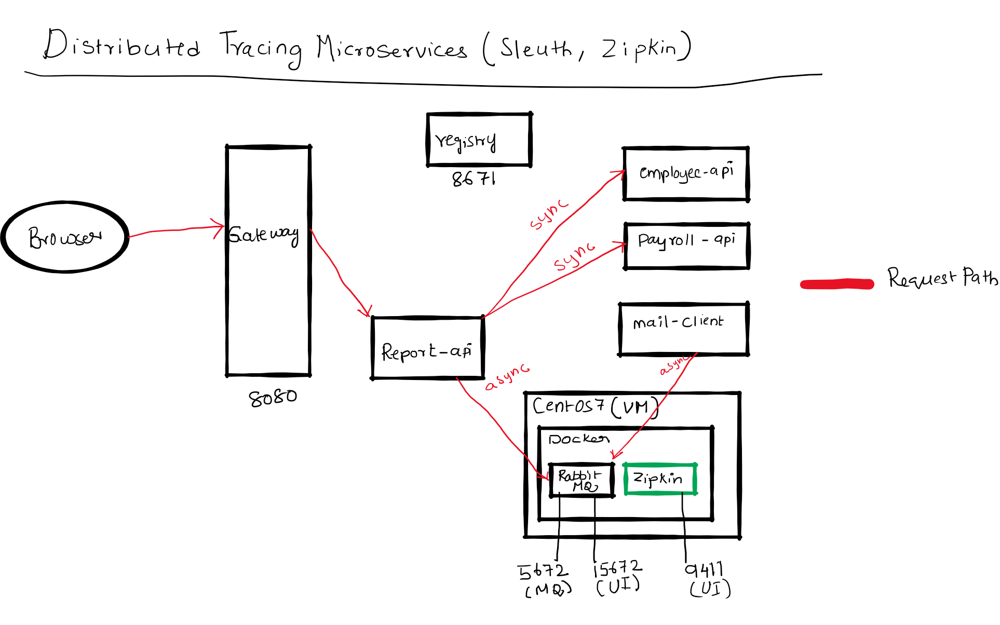
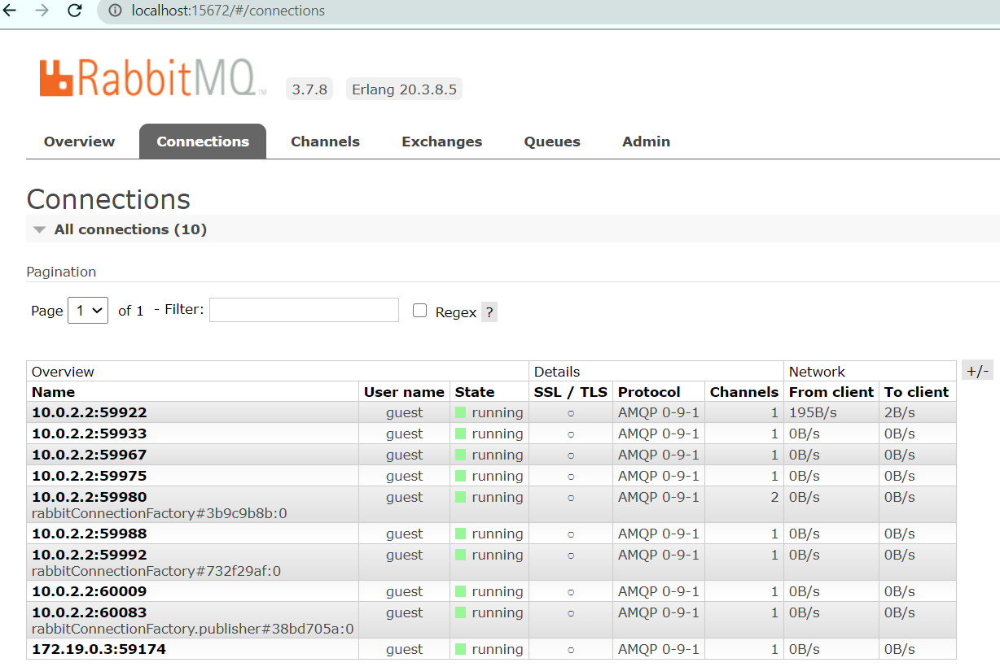
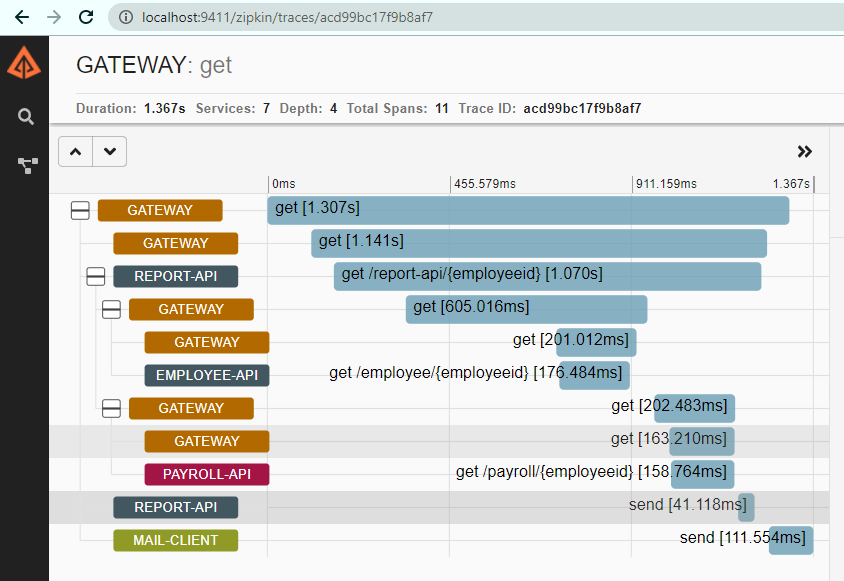

# Spring Cloud Session-7 Microservices distributed Tracing
In  this tutorial we are going to learn how to trace a message that is going across multiple microservices.In micorservices 
landscape it is common to have multiple cooperating microservices. It is important for us to understand how the call is 
flowing across these services.

**Overview**
- When user wants to get employee report the report is served by report-api microservice.
- Call flow: Browser -> gateway->report-api (report-api synchronous calls employee-api,payroll-api and asynchronusly calls mail-client)
- Complete(Request and Response) flow: 
    - browser->gateway-> report-api
    - report-api(synch)->gateway->employee-api
    - report-api(synch)->gateway->payroll-api
    - report-api(asynch)-> RabittMQ (MessageBus)
    - response is served to browser             
- The above request flow is really complex, and it is really tough to understand if there is intermediately failure or slowness.
- We will be using **Spring Cloud Sleuth** and **Zipkin** to trace the call flow.

**Terminology**
- Trace or Trace tree: The complete request flow is called trace or trace tree
- Span: The basic unit of work are called Span. Spans can consist of sub spans forming the trace tree.
**Flow**
- Each and every microservice (gateway,employee-api,payroll-api,report-api,mail-client,registry) has sleuth and zipkin components
- When a request to comes to microservice sleuth adds traceid and zipkin clients send this traceid to MessageBus (RabbitMQ)
- traceids are saved in **zipkin queue** in RabbitMQ
- Zipkin server reads this trace information from queue and computes the callflow.
- Zipkin UI can be used to view call trace
- Run RabbitMQ server, it binds to port 5672 and admin ui application to port 15672.
- Run Zipkin UI server 9411

# Source Code 
``` git clone https://github.com/balajich/spring-cloud-session-7-microservices-distributed-tracing.git``` 
# Video
[](https://www.youtube.com/watch?v=8CV8PDX8Kuc)
- https://youtu.be/8CV8PDX8Kuc
# Architecture

# Prerequisite
- JDK 1.8 or above
- Apache Maven 3.6.3 or above
- Vagrant, Virtualbox (To run RabbitMQ Server)
# Start RabbitMQ, Zipkin Servers and Build Microservices
We will be running RabbitMQ,Zipkin server inside a docker container. I am running docker container on CentOS7 virtual machine. 
I will be using vagrant to stop or start a virtual machine.
- RabbitMQ & Zipkin Server
    - ``` cd spring-cloud-session-7-microservices-distributed-tracing ```
    - Bring virtual machine up ``` vagrant up ```
    - ssh to virtual machine ```vagrant ssh ```
    - Switch to root user ``` sudo su - ```
    - Change folder where docker-compose files is available ```cd /vagrant```
    - Start RabbitMQ & Zipkin Server using docker-compose ``` docker-compose up -d ```
- Java
    - ``` cd spring-cloud-session-7-microservices-distributed-tracing ```
    - ``` mvn clean install ```
# RabbitMQ Server UI

# Zipkin

# Running components
- Registry: ``` java -jar .\registry\target\registry-0.0.1-SNAPSHOT.jar ```
- Employee API: ``` java -jar .\employee-api\target\employee-api-0.0.1-SNAPSHOT.jar ```
- Payroll API: ``` java -jar .\payroll-api\target\payroll-api-0.0.1-SNAPSHOT.jar ```
- Report API: ``` java -jar .\report-api\target\report-api-0.0.1-SNAPSHOT.jar ```
- Mail Client App: ``` java -jar .\mail-client\target\mail-client-0.0.1-SNAPSHOT.jar ```
- Gateway: ``` java -jar .\gateway\target\gateway-0.0.1-SNAPSHOT.jar ``` 

# Using curl to test environment
**Note I am running CURL on windows, if you have any issue. Please use postman client, its collection is available 
at spring-cloud-session-3-inter-microservice-communication-sync.postman_collection.json**
- Access RabbitMQ UI: ```http://localhost:15672/  ```
- RabbitMQ defaults username/password: ``` guest/guest ```
- Access Zipkin UI: ``` ```
- Get employee report using report api ( direct): ``` curl -s -L  http://localhost:8080/report-api/100 ```
# Scale up
- **Deprecated**  docker-compose scale employee-api=2
- **Spin instance**  docker-compose up --scale employee-api=2 -d

  
# Code
In this section will focus only on report-api code which publishes employee details to queue **queue.email** 

*ReportController* in app **report-api**.  @SendTo(Processor.OUTPUT) makes the function to invoke RabbitMQ and writes
details to MQ.
```java
    @SendTo(Processor.OUTPUT)
    public Employee getEmployeeDetails(@PathVariable int employeeId) {
       
        Employee finalEmployee = new Employee(responseEmployeeNameDetails.getId(), responseEmployeeNameDetails.getName(), responseEmployeePayDetails.getSalary());
        // Send to message bus
        processor.output().send(MessageBuilder.withPayload(finalEmployee).build());
       
    }
```
**application.yml** in report-api. 
```yaml
 cloud:
    stream:
      bindings:
        output:
          destination: queue.email
          binder: local_rabbit
      binders:
        local_rabbit:
          type: rabbit
          environment:
            spring:
              rabbitmq:
                host: localhost
                port: 5672
                username: guest
                password: guest
                virtual-host: /
```
mail-client code that reads messages from queue. @StreamListener(Processor.INPUT) reads data from queue **email.queue**
```java
@SpringBootApplication
@EnableBinding(Processor.class)
public class MailClientApplication {

    public static void main(String[] args) {
        SpringApplication.run(MailClientApplication.class, args);
    }

    @StreamListener(Processor.INPUT)
    public void receivedEmail(Employee employee) {
        System.out.println("Received employee details: " + employee);
        System.out.println("Sending email and sms: "+employee.getName());
    }

}
```
**application.yml** of mail-client
```yaml
application:
    name: email-api
  cloud:
    stream:
      bindings:
        input:
          destination: queue.email
          binder: local_rabbit
          group: emailconsumers
      binders:
        local_rabbit:
          type: rabbit
          environment:
            spring:
              rabbitmq:
                host: localhost
                port: 5672
                username: guest
                password: guest
                virtual-host: /
```
# References
- https://www.baeldung.com/spring-cloud-stream
- Spring Microservices in Action by John Carnell 
- Hands-On Microservices with Spring Boot and Spring Cloud: Build and deploy Java microservices 
using Spring Cloud, Istio, and Kubernetes -Magnus Larsson
- https://www.cloudamqp.com/blog/2017-07-25-RabbitMQ-and-AMQP-concepts-glossary.html 
# Next Tutorial
How to deploy microservices using docker
- https://github.com/balajich/spring-cloud-session-6-microservices-deployment-docker